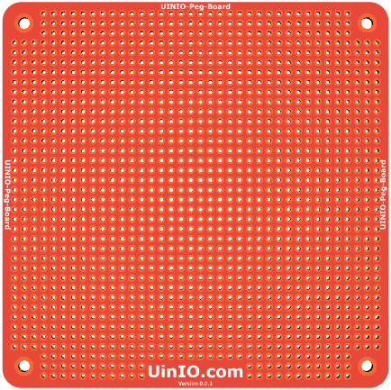

# UINIO-Peg-Board 洞洞板

[**UINIO-Peg-Board**](https://gitee.com/uinika/UINIO-Peg-Board) 是一款**长度**和**宽度**均等于 `10cm`，焊盘间距保持在 `2.54mm` 的万用 PCB 洞洞板，可以用来方便的搭建一些接插元件的实验电路。

1. 板框上下左右四个角上都分别制作有 `3cm` 的固定螺丝孔；
2. PCB 板框的 4 个边角分别进行了 `5cm` 直径的圆角处理；
3. 建议使用黑色磨砂材质的阻焊油墨，打样之后的视觉效果更佳；
4. 工程的 `Edge` 目录下面是使用 **FreeCAD** 绘制的板框；
5. 通过修改洞洞板 [**UinIO.com**](www.uinio.com) 丝印下面的 `Version 1.0.1` 版本号，可以规避板厂的重复性检查；
